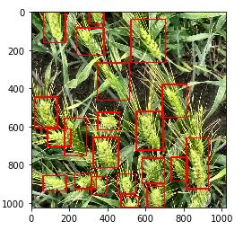

## Advanced Computer Vision - Wheat Detection by Vincent

This is a competition hosted on Kaggle on detecting wheat heads from a given image. The full details can be found here: [https://www.kaggle.com/c/global-wheat-detection/overview](https://www.kaggle.com/c/global-wheat-detection/overview).

The training dataset is made up of 3373 images, with the annotations found in **train.csv**. Full details can be found here: [https://www.kaggle.com/c/global-wheat-detection/data](https://www.kaggle.com/c/global-wheat-detection/data). The csv file contains 4 columns:

 1. image_id - File name of the image
 2. width - Width of the image
 3. height - Height of the image
 4. bbox - In the form [xmin, ymin, width, height]

### Data
Several notebooks on Kaggle have highlighted certain problems with the data - [https://www.kaggle.com/aleksandradeis/globalwheatdetection-eda](https://www.kaggle.com/aleksandradeis/globalwheatdetection-eda). The main problem is the presence of extremely large bounding boxes that does not seem to contain any single particular wheat head. These images can be seen below:

These bounding boxes have been singled by me using the code found in **filter.ipynb**. The general approach is to compare the area of the bounding boxes within the image and filter out exceptionally huge bounding boxes using the IQR rule.

### Approach
To figure out the best approach for this problem, I looked up the SOTA for Object Detection on COCO dataset from [https://paperswithcode.com/sota/object-detection-on-coco](https://paperswithcode.com/sota/object-detection-on-coco) and decided to go ahead with EfficientDet.

I decided to use this repo that implements EfficientDet - [https://github.com/xuannianz/EfficientDet](https://github.com/xuannianz/EfficientDet). I manipulated the csv file into the format required for training as stated on the repo link using **filter.ipynb** as well. I could only train an EfficientDet-D2 with an 8Gb Tesla M60 these 2 commands: 

    python train.py --snapshot imagenet --phi 2 --gpu 0 --random-transform --compute-val-loss --freeze-backbone --batch-size 2 --steps 1517 csv train.csv classes.csv --val val.csv

and

    python train.py --snapshot imagenet --phi 2 --gpu 0 --random-transform --compute-val-loss --freeze-bn --batch-size 2 --steps 1517 csv train.csv classes.csv --val val.csv

This allowed me to get a validation mAP of ~0.93 at the end of the training.

### Evaluation
The submission notebook on Kaggle can be found here: [https://www.kaggle.com/vincentyong97/efficientdet-inference](https://www.kaggle.com/vincentyong97/efficientdet-inference). The code needed to run inference can be found on there as well.

An example of the output looks as such: 

